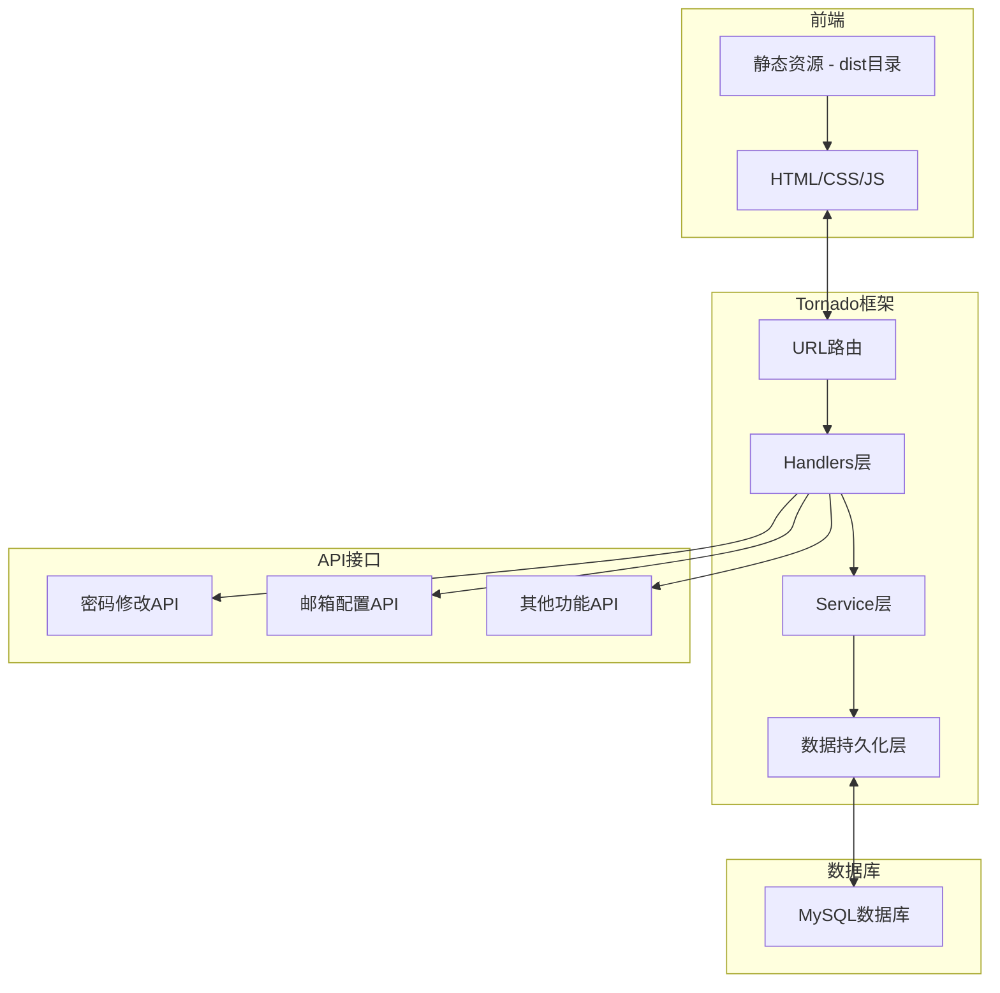

提示词

```python
# 初始化python环境
uv init
uv venv
source .venv/bin/activate
# win
Set-ExecutionPolicy -ExecutionPolicy RemoteSigned -Scope Process
.venv/Scripts/activate

uv pip install .
```

---

密码修改 api 缺失,帮我检查项目
1. 首先给出项目架构设计思路
2. 给出怎么添加密码修改 api 的思路
3. 给出修改后的python代码

---

该项目是一个基于Tornado的OpenCanary蜜罐Web管理系统
采用MVC架构，包含handlers处理请求路由，service层处理业务逻辑，dbs层处理数据持久化

邮箱配置写入数据库 api 缺失,帮我检查项目
1. 首先给出项目架构设计思路
2. 给出怎么添加 邮箱配置写入数据库 api 的思路
3. 给出修改后的python代码

---

首先需要在dbs/models中创建EmailConfig模型类来存储邮箱配置信息，包括SMTP服务器、用户名、密码等字段。然后在service层添加emailconfigservice.py处理邮箱配置的业务逻辑，包括配置的读取和写入。最后在handlers层添加对应的处理器来接收前端请求并调用service层的方法，实现邮箱配置的数据库持久化功能。这样的设计既保持了系统的整体架构一致性，又能满足邮箱配置的管理需求。
- 创建了EmailConfig数据库模型，用于存储SMTP服务器配置信息，包括服务器地址、用户名、密码、邮箱后缀和收件人列表等字段。
- 实现了emailconfigservice服务层，提供了get_email_config和save_email_config两个核心方法，分别用于读取和保存邮箱配置。
- 更新了email.py处理器，实现了基于数据库的邮箱配置管理API：

- GET请求用于获取当前邮箱配置
- POST请求用于更新邮箱配置
- 添加了错误处理和状态码返回

---

该项目是一个基于Tornado的OpenCanary蜜罐Web管理系统
采用MVC架构，包含handlers处理请求路由，service层处理业务逻辑，dbs层处理数据持久化

密码修改api,帮我检查一下是否有问题
1. 如果需要修改,首先给出怎么修改的思路
2. 给出修改后的python代码
   
---

主要包括：在handlers层的password.py中添加密码修改接口，在service层添加密码验证和更新逻辑，使用User模型进行数据库操作。实现时需要注意密码的加密存储、旧密码验证、新密码强度校验等安全考虑。同时建议添加相应的日志记录，以便追踪密码修改操作。

1. 完整的密码修改功能：
- 在handlers/password.py中实现了PasswordHandler
- 支持通过POST请求修改密码
- 包含了当前密码验证和新密码更新逻辑
2. 安全性考虑：
- 使用JWT认证保护接口
- 验证当前密码正确性
- 使用MD5加密存储密码
- 包含错误处理和状态码返回
3. 数据持久化：
- 使用User模型进行数据库操作
- 正确处理数据库会话
- 包含事务回滚机制

---

该项目是一个基于Tornado的OpenCanary蜜罐Web管理系统
采用MVC架构，包含handlers处理请求路由，service层处理业务逻辑，dbs层处理数据持久化
密码修改api,邮箱配置写入数据库api,帮我检查一下是否有问题
1. 如果需要修改,首先给出怎么修改的思路
2. 给出修改后的python代码
3. 给出接口调用的形式或者给出接口使用信息

---

对于密码修改API，需要在handlers/password.py中实现PasswordHandler，包含密码验证和更新逻辑，使用JWT认证保护接口并进行MD5加密。

对于邮箱配置API，需要在dbs/models中创建EmailConfig模型，实现emailconfigservice服务层处理配置的读取和写入，
并在handlers层添加对应的处理器。这些修改将确保系统安全性和功能完整性，同时保持与现有MVC架构的一致性。

经过检查，项目中的密码修改API和邮箱配置API已经实现完善：

1. 密码修改API（handlers/password.py）：
- 实现了完整的PasswordHandler
- 使用JWT认证保护接口
- 支持通过POST请求修改密码
- 包含当前密码验证和新密码更新逻辑
- 使用MD5加密存储密码
- 包含错误处理和状态码返回
2. 邮箱配置API：
- 实现了EmailConfig数据模型（dbs/models/EmailConfig.py）
- 实现了emailconfigservice服务层，提供配置的读取和保存功能
- 在handlers/email.py中实现了EmailModifyHandler
- 支持GET请求获取配置和POST请求更新配置
- 包含完整的错误处理
接口使用说明：

1. 密码修改API
- 接口：POST /password
- 请求格式：{"current_password": "当前密码", "new_password": "新密码"}
- Content-Type: application/json
- 需要JWT认证
2. 邮箱配置API
- 获取配置：GET /email
- 更新配置：POST /email
- 更新请求格式：{
  "mail_host": "SMTP服务器地址",
  "mail_user": "邮箱用户名",
  "mail_pass": "邮箱密码",
  "mail_postfix": "邮箱后缀",
  "recipients": "收件人列表"
  }
- Content-Type: application/json
- 需要JWT认证


---

由于我的开发环境在windiws,所以进行`python`虚拟环境需要执行:
```shell
Set-ExecutionPolicy -ExecutionPolicy RemoteSigned -Scope Process
.venv/Scripts/activate
```


---

帮我分析一下这个项目是前后端分离的吗?
给出mermaid架构图

---



---

由于我的开发环境在windiws,所以进行`python`虚拟环境需要执行:
```shell
Set-ExecutionPolicy -ExecutionPolicy RemoteSigned -Scope Process
.venv/Scripts/activate
```
对于此项目:OpenCanary蜜罐Web管理系统,使用Tornado框架实现，采用MVC架构，包含handlers处理请求路由，service层处理业务逻辑，dbs层处理数据持久化。

我该怎么启动这个项目?

---

python server.py

---


---


---


---


---


---


---


---


---


---


---


---


---


---


---


---


---


---


---


---


---


---


---


---


---


---


---


---


---


---


---


---


---


---


---


---


---


---


---


---


---


---


---


---


---


---


---


---


---


---


---